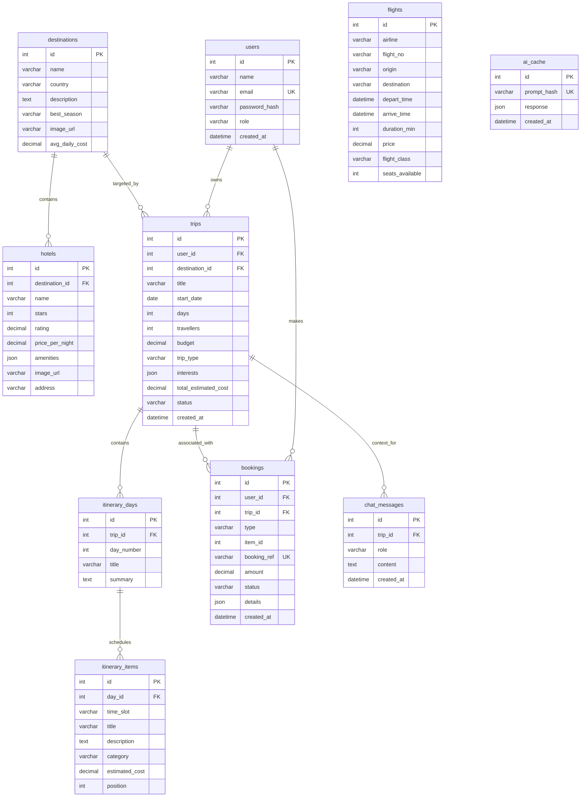

# TripGenie — Database ER Diagram

The database uses SQLAlchemy 2.0 and supports both SQLite (default zero-config) and MySQL 8.0.

```mermaid
erDiagram
    users {
        int id PK
        varchar name
        varchar email UK
        varchar password_hash
        varchar role
        datetime created_at
    }
    destinations {
        int id PK
        varchar name
        varchar country
        text description
        varchar best_season
        varchar image_url
        decimal avg_daily_cost
    }
    hotels {
        int id PK
        int destination_id FK
        varchar name
        int stars
        decimal rating
        decimal price_per_night
        json amenities
        varchar image_url
        varchar address
    }
    flights {
        int id PK
        varchar airline
        varchar flight_no
        varchar origin
        varchar destination
        datetime depart_time
        datetime arrive_time
        int duration_min
        decimal price
        varchar flight_class
        int seats_available
    }
    trips {
        int id PK
        int user_id FK
        int destination_id FK
        varchar title
        date start_date
        int days
        int travellers
        decimal budget
        varchar trip_type
        json interests
        decimal total_estimated_cost
        varchar status
        datetime created_at
    }
    itinerary_days {
        int id PK
        int trip_id FK
        int day_number
        varchar title
        text summary
    }
    itinerary_items {
        int id PK
        int day_id FK
        varchar time_slot
        varchar title
        text description
        varchar category
        decimal estimated_cost
        int position
    }
    bookings {
        int id PK
        int user_id FK
        int trip_id FK
        varchar type
        int item_id
        varchar booking_ref UK
        decimal amount
        varchar status
        json details
        datetime created_at
    }
    chat_messages {
        int id PK
        int trip_id FK
        varchar role
        text content
        datetime created_at
    }
    ai_cache {
        int id PK
        varchar prompt_hash UK
        json response
        datetime created_at
    }

    users ||--o{ trips : "owns"
    users ||--o{ bookings : "makes"
    destinations ||--o{ hotels : "contains"
    destinations ||--o{ trips : "targeted_by"
    trips ||--o{ itinerary_days : "contains"
    trips ||--o{ bookings : "associated_with"
    trips ||--o{ chat_messages : "context_for"
    itinerary_days ||--o{ itinerary_items : "schedules"
```
